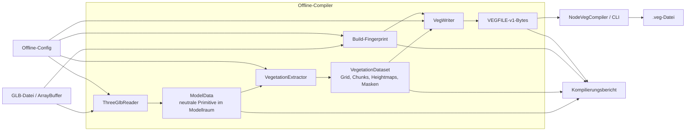

# Offline-Pipeline

Die Offline-Pipeline übersetzt ein GLB-Modell und eine Compiler-Config in eine
kompakte, validierte `.veg`-Datei. Sie enthält keine Three.js-Runtime- oder
GPU-Ressourcen.

## Datenfluss



## Stufen und Verantwortung

### 1. Eingaben

Die GLB-Datei liefert Geometrie, Hierarchie, Transformationen, Mesh- und
Materialnamen. Die Offline-Config legt Auswahlregeln, Koordinatensystem,
Chunkgröße, Heightmap- und Maskenauflösungen, Seed sowie das Writerformat fest.

Der Configvertrag liegt in `config/types.ts`. Eine Projektconfig wie
`config/icaka.vegetation.config.ts` bleibt außerhalb der Bibliotheksmodule.

### 2. Reader

`ThreeGlbReader` übersetzt Three.js-kompatible GLB-Daten in `ModelData`:

- Hierarchietransformationen werden in den lokalen Raum der GLB-Wurzel
  eingerechnet;
- Dreieckspositionen und Indizes werden als neutrale Primitive ausgegeben;
- Namen, Hierarchie und User-Data bleiben für spätere Auswahlregeln erhalten;
- Instanced Meshes, Skinned Meshes und aktive Morph Targets werden in v1
  ausdrücklich abgelehnt, statt unvollständig interpretiert zu werden.

Der Reader kennt keine Vegetationslayer, Chunks oder VEGFILE-Bytes.

### 3. Extractor

`extractVegetation` verbindet `ModelData` mit der Extraktionsconfig und erzeugt
das dateiformatunabhängige `VegetationDataset`:

- Auswahl von Höhen- und Vegetationsflächen;
- Aufbau des logischen Chunk-Grids;
- `chunkLookup` zwischen logischen und tatsächlich gespeicherten Chunks;
- unquantisierte Heightmap pro gespeichertem Chunk;
- binäre Cell-Maske pro Vegetationslayer;
- Steigungsfilter, Layerüberlappung und Seed.

Die v1-Heightmap speichert pro horizontalem Sample genau eine Höhe. Bei mehreren
Treffern gewinnt die höchste Fläche; fehlende Samples werden aus dem nächsten
vorhandenen Sample aufgefüllt.

### 4. Build-Fingerprint

GLB-Bytes und kanonische Compiler-Config erzeugen gemeinsam einen 128-Bit-
Build-Fingerprint. Er identifiziert die Eingabekombination, nicht nur den
fertigen Byteinhalt. Gleiche Eingaben erzeugen denselben Fingerprint.

### 5. Writer

`writeVegFile` übernimmt ausschließlich Binärkodierung:

- Dataset validieren;
- Heightmaps auf 8, 16 oder 32 Bit quantisieren;
- je 32 Maskenzellen in ein `Uint32` packen;
- Header, Layer-Metadaten, Lookups und Datenbereiche schreiben;
- Build-Fingerprint eintragen;
- CRC32 über die vollständige Datei berechnen.

Der Writer liefert ein `Uint8Array` und führt selbst keine Dateisystemoperation
aus. Dadurch bleibt er unabhängig von Node.js.

### 6. Node-Compiler und CLI

`compileGlbToVeg` orchestriert Reader, Extractor, Fingerprint und Writer für
bereits geladene Bytes. `createVegFile` ergänzt die Node.js-Dateischnittstelle
und ersetzt eine vorhandene Zieldatei erst, nachdem die neue Datei vollständig
erstellt wurde. Die CLI verarbeitet ausschließlich Pfade und Configimport.

```text
npm run veg:compile -- --input <model.glb> --config <config.ts> --output <asset.veg>
```

## Zentrale Verträge

```text
ArrayBuffer
  → ModelData
  → VegetationDataset
  → Uint8Array mit VEGFILE v1
  → .veg-Datei
```

Jede Grenze hat genau eine Verantwortung:

- `ModelData` ist readerneutral und kennt keine Vegetationssemantik;
- `VegetationDataset` ist dateiformatneutral und enthält unquantisierte Daten;
- VEGFILE v1 ist die persistente CPU-Datenschnittstelle;
- GPU-Layouts entstehen ausschließlich in Runtime-Adaptern.

Vertiefende Details stehen in `reader/reader.md`, `extractor/extractor.md`,
`writer/writer.md` und `compiler/compiler.md`.
