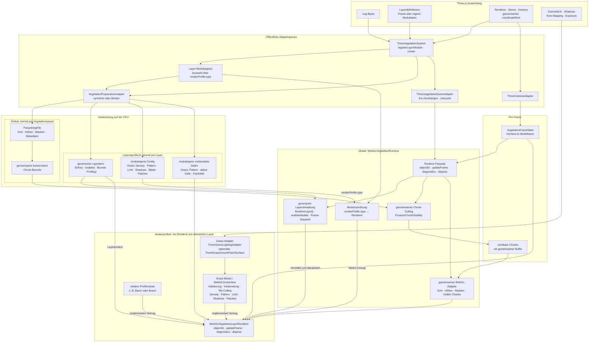

# Runtime-Pipeline

Die Runtime-Pipeline lädt ein VEGFILE, verbindet dessen Layer mit registrierten
Rendermodulen und führt gemeinsames Chunk-Culling aus. `ThreeVegetationSystem`
ist der Standardweg für Three.js. `createThreeVegetation` bleibt als direkter,
kompatibler Einstieg erhalten.

## Standardintegration

```ts
const system = createThreeVegetationSystem({
  renderer,
  scene,
  camera,
  coordinateRoot: modelRoot,
})

system.registerLayerModule(customTreeModule)

const vegetation = await system.create({
  source: vegetationBytes,
  layers: [
    grassPreset({
      layerId: 0,
      key: 'meadow-grass',
      density: { renderTileSizeCells: 16 },
    }),
    treeLayer,
  ],
})

vegetation.updateFrame()
vegetation.setLayerEnabled('meadow-grass', false)
vegetation.dispose()
```

Das System erzeugt die Standardadapter für Szene und Kamera. Der Scene-Adapter
hängt `runtime.object3d` unter `coordinateRoot` oder ohne
expliziten Root direkt unter die Szene. Damit verwenden Vegetationsgeometrie,
Kameraumrechnung und Culling denselben Modellraum. Er besitzt keine Lichter und
kein Day/Night-Modell. Diese bleiben Eigentum der Hostszene; die austauschbare
Lichtgrenze verwendet standardmäßig direkt den nativen Three.js-Lichtpfad.

`setLayerEnabled` schaltet Layer um, die beim Erzeugen der Runtime aktiviert
und deshalb mit GPU-Ressourcen initialisiert wurden. Ein in der Config
deaktivierter Layer wird nicht verdeckt im Hintergrund vorbereitet.

## Datenfluss



Der Layer-Manager ist keine zusätzliche öffentliche
Klasse. `WebGLVegetationRuntime` übernimmt diese Verantwortung mit seiner
Renderer-Registry und der Liste initialisierter `RuntimeLayer`-Einträge. Sie
wählt für jeden aktivierten Layer anhand von `renderProfile.type` genau ein
Modul, verwaltet Ein-/Ausschaltung und Lifecycle und delegiert das Frameupdate.

„Global“ bezeichnet hier Daten und Systeme, die pro Vegetationsasset nur einmal
existieren und von allen Layer-Renderern geteilt werden. Es ist kein zweiter
Block mit vermeintlich globalen Grass-Einstellungen. Der generische Layerkern
kennt nur Identität, Aktivierung, konservative Culling-Bounds und den Profiltyp.
Verteilung, Pattern, Density/LOD, Sichtweite, Shadows, Lighting, Geometrie und
opinionated Features gehören dem jeweiligen Modul. Beim Grass-Modul umfasst das
auch die vorbereiteten Pattern, aktiven Cells und das Patchfeld.

Die serialisierbare Config enthält deshalb derzeit außer `configVersion` nur
`layers[]`: Es gibt noch keine globalen, konfigurierbaren Renderparameter.
Renderer, Szene, Kamera, Preparation-Adapter und Layer-Module sind
nicht serialisierbare Runtime-Optionen. Gemeinsames Chunking, Chunk-Culling und
GPU-Ressourcen sind globale Implementierungsverantwortungen und werden nicht in
jedem Layer wiederholt.

Im Frameupdate führt die Runtime das grobe Chunk-Culling einmal aus und schreibt
einen gemeinsamen Visible-Chunk-Buffer. Danach aktualisiert die Layerverwaltung
jeden aktiven Renderer. Dieser entscheidet selbst über sein feineres Culling,
seine Dichte und seine profilspezifischen Renderressourcen.

## Initialisierung

### Runtime-Fassade und Vorbereitung

`ThreeVegetationSystem` bündelt die Three.js-Standardadapter und die
Modulregistry. `createWebGLVegetationRuntime` besitzt Dataset, gemeinsame Bounds,
Frustum-Culling, gemeinsame WebGL-Ressourcen und die erzeugten Layer-Renderer. Die
Factory ist asynchron, damit synchrone und Worker-basierte Vorbereitung dieselbe
Schnittstelle verwenden. Der Standard `SynchronousVegetationPreparation`
arbeitet auf dem aufrufenden Thread. `WorkerVegetationPreparation` verschiebt
Parser, Dataset, profilabhängige Vorbereitung wie das Grass-Patch-Feld und aktive Cell-Zulassung in einen kurzlebigen
Module-Worker und transferiert die erzeugten Buffer zurück. Der Consumer liefert
nur die bundlerspezifische Worker-Factory:

```ts
const preparation = new WorkerVegetationPreparation(() => new Worker(
  new URL('./vegetation.worker.ts', import.meta.url),
  { type: 'module' },
))
```

Die zugehörige Worker-Datei enthält keine eigene Vegetationslogik:

```ts
import {
  installVegetationPreparationWorker,
  type VegetationPreparationWorkerScope,
} from 'three-vegetation-pipeline'

installVegetationPreparationWorker(
  self as unknown as VegetationPreparationWorkerScope,
)
```

Schlägt eine GPU-Erzeugungsstufe fehl, werden alle vorher erzeugten Texturen,
Buffer, Materialien und Geometrien in umgekehrter Reihenfolge freigegeben.
`dispose()` ist idempotent und räumt die gesamte erfolgreich erstellte Runtime
über einen Aufruf auf.

### 1. Laden und Parsen

Das Laden einer URL bleibt Aufgabe der Anwendung. `parseVegFile` erhält einen
`ArrayBuffer` oder ein `Uint8Array`, validiert VEGFILE v1 vollständig und gibt
ein `ParsedVegFile` zurück. Masken und Heightmaps bleiben gepackt beziehungsweise
quantisiert. Bei geeigneter Ausrichtung zeigen die Typed Arrays direkt auf die
ursprünglichen Dateibytes.

### 2. Runtime-Dataset

`createVegetationRuntimeDataset` verbindet Parserdaten und Layerdefinitionen
über stabile Layer-IDs. Dabei werden:

- Configwerte einmalig validiert;
- fehlende oder doppelte Layerzuordnungen abgelehnt;
- Cell-Größen in Modell- und Metereinheiten berechnet;
- optionale Modulvalidierung ausgeführt;
- moduleigene Profildaten einmalig erzeugt, bei Grass Pattern, aktive Cells und
  das optionale Patch-Feld;
- aktivierte Layer als eigene Ansicht bereitgestellt;
- die größten aktiven `VegetationRenderBounds` für das gemeinsame grobe
  Chunk-Culling kombiniert.

Das eingebaute Grass-Profil wird dadurch nicht zum Pflichtschema für spätere
Baum- oder Buschmodule. Ein fremdes Modul kann eine eigene serialisierbare
Config und eigene vorbereitete Daten verwenden; nur der generische Layerkern
und der Renderer-Lifecycle sind fest.

Das Dataset kopiert die großen VEGFILE-Datenbereiche nicht.

Das Grass-Modul bereitet seine statische VEG-Zulassung vor und mischt die
Cell-Reihenfolge seedbasiert. Dataset und moduleigene Arrays können in einem
Worker entstehen und anschließend über den Transfervertrag des Moduls
übertragen werden.

### 3. Chunk-Begrenzungsboxen

`createRuntimeChunkBoundingBoxes` erzeugt für jeden gespeicherten Chunk sechs
Werte und berücksichtigt dabei die kombinierten Profil-Bounds:

```text
minimumX, minimumY, minimumZ, maximumX, maximumY, maximumZ
```

Diese Boxen liegen im lokalen Modellkoordinatensystem und werden nur einmal
berechnet. Sie sind Zahlendaten und keine unsichtbaren Three.js-Meshes.

### 4. Statische WebGL-Ressourcen

`WebGLStaticVegetationResources` lädt einmalig:

- Gridkoordinaten pro gespeichertem Chunk;
- minimale und maximale Chunkhöhe;
- quantisierte Heightmaps;
- bitgepackte Layer-Masken.

`WebGLVisibleChunkBuffer` reserviert zusätzlich einmalig Platz für maximal alle
gespeicherten Chunkindizes.

### 5. Layer-Renderer

Die Runtime wählt für jeden aktivierten Layer über `renderProfile.type` genau
ein `WebGLVegetationLayerModule`. Ein Modul darf optionale Configvalidierung,
CPU-Vorbereitung und Transferbuffer sowie die Renderer-Erzeugung besitzen. Das
eingebaute Profil `grass` erzeugt eine `WebGLGrassView`. Zusätzliche Profile
werden über `system.registerLayerModule(...)` registriert. Der ältere
`layerRenderers`-Einstieg bleibt vorerst kompatibel, deckt aber nur Rendering ab.

Jeder Renderer erhält dasselbe Dataset, den gemeinsamen WebGL-Adapter und die
moduleigenen vorbereiteten Daten seines Layers. Er besitzt ausschließlich seine
profilspezifischen Ressourcen. Bei Grass sind das Patterntextur, Farbpaletten,
optionales RG-Patch-Feld, Density-Tile- und Active-Cell-Buffer sowie Geometrien
und Materialien. Gemeinsame VEGFILE-Texturen und die sichtbaren Chunkindizes
werden dadurch nicht pro Layer-Renderer dupliziert.

Der eingebaute Grass-Renderer verwendet standardmäßig den
`ThreeSceneLightingAdapter`. Er setzt `lights: true`, bindet Three.js-Licht- und
Shadow-Uniforms ein und hält die versionsabhängigen Lighting-, Shadow-,
Tone-Mapping- und Color-Space-Chunks aus dem Grass-Shader heraus. Three.js
aktualisiert Lichtfarben, Intensitäten, Shadowmaps und Renderer-Exposure über
seinen normalen Renderpfad; die Vegetationsruntime durchsucht oder kopiert
keine Szenenlichter pro Frame. Ein Ersatzadapter wird über
`createWebGLGrassLayerRenderer({ lighting })` registriert.

## Verarbeitung pro Frame

### 1. Frustum-Culling

`ThreeCameraAdapter` liest Three-Kamera und Vegetationsroot und aktualisiert
einen wiederverwendeten `VegetationFrameState`. Er enthält Kameraposition im
Modellraum, `projection × view × model` und den Clip-Space-Tiefenraum. Eine
Anwendung mit eigenem Kamera- oder XR-System kann denselben neutralen
Framevertrag über `cameraAdapter` direkt bedienen, ohne Dataset oder
Layerprofile zu verändern.

`FrustumChunkVisibility` prüft jede Chunk-Box gegen die sechs Frustumebenen und
überschreibt nur den verwendeten Präfix seines bestehenden Ergebnisarrays:

```text
visibleChunkIndices[0 .. visibleChunkCount)
```

Die groben Chunk-Boxen bleiben der erste günstige Filter. Die anschließende
Tile-Dichteberechnung prüft jede maskenaktive Render-Tile-Box mit denselben
Frustumebenen und den Bounds des jeweiligen Layers, bevor sie Distanzbudgets
berechnet oder einen GPU-Record schreibt.

### 2. Upload der sichtbaren Chunks

`WebGLVegetationAdapter.updateVisibleChunks` kopiert den gültigen Präfix in den
bereits reservierten Visible-Chunk-Buffer. Es wird kein neues Array pro Frame
angelegt. Der Renderer zeichnet anschließend ausschließlich Einträge dieses
Buffers.

### 3. Optionale Debugdarstellung

`WebGLDebugChunkView` zeichnet momentan eine Heightmap-Fläche pro sichtbarem
Chunk. Der Fragment-Shader zeigt aktive Cells und ihre Pattern-Anker. Diese
Darstellung diagnostiziert dieselben Runtime- und GPU-Ressourcen, ist aber vom
produktiven Vegetationsrenderer getrennt.

### 4. Statischer WebGL-Grasrenderer

Die eingebaute `WebGLGrassView` verwendet eine einmalig vorberechnete,
seedbasiert gemischte
Liste maskenaktiver Cells. Nach dem Chunk-Culling verwirft ein zweiter
Frustumtest nicht sichtbare Render-Tiles. Drei kontinuierliche Distanzkurven
bestimmen für die verbleibenden Tiles die Cell-, Anchor- und Elementbudgets.
Tiles werden in die kleinste ausreichende GPU-Kapazitätsklasse gruppiert;
Nullbudgets starten keinen Draw. Der Vertex-Shader rekonstruiert Pattern und
Hashhierarchie, liest die Heightmap und positioniert die feste Halmgeometrie.
Halmform, Versatz und Farben werden vollständig aus Config und stabilen
Hashwerten abgeleitet.

`WebGLVegetationRuntime.updateFrame` führt Chunk-Culling und anschließend die
layerspezifischen Tile-/Density-Updates aus. Der Consumer ruft dadurch keine
internen Buffer- oder Rendererklassen mehr selbst auf. Eine wiederverwendete,
schreibgeschützte Diagnosestruktur liefert Chunk-, Tile- und Kandidatenzahlen,
ohne GPU-Ressourcen öffentlich zu machen.

Ein optionales `groundPatchSurface` bleibt Eigentum des Grass-Renderers.
`ThreeGrassGroundPatchSurface` erhält vom Consumer nur den gemeinsamen
Koordinatenroot und das Materialprädikat. Installation, horizontale Datasetachsen,
Shaderpatch und vollständiges Restore liegen innerhalb der Pipeline.

## Koordinaten und Indizes

| Wert                 | Bedeutung                                                      | Speicherung                                                              |
| -------------------- | -------------------------------------------------------------- | ------------------------------------------------------------------------ |
| `storedChunkIndex` | Adresse eines belegten Chunks in gepackten Arrays und Texturen | VEGFILE und Visible-Chunk-Buffer                                         |
| `chunkGridX/Y`     | Stabile Position des Chunks im logischen Grid                  | Einmal pro gespeichertem Chunk auf der GPU                               |
| `localCellX/Y`     | Cell innerhalb eines Chunks, beispielsweise 0 bis 127          | Aus Maskenindex oder Shaderarbeit abgeleitet                             |
| `globalCellX/Y`    | Cell im gesamten Layergrid                                     | Nicht gespeichert; aus Grid- und lokalen Koordinaten berechnet           |
| Modellkoordinaten    | Tatsächliche Position relativ zur Modellwurzel                | Aus Gridursprung, Chunkgröße, Cellposition und Heightmap rekonstruiert |

Die globale Cell-Koordinate entsteht nur für die stabile Identität:

```text
globalCellX = chunkGridX * maskResolution + localCellX
globalCellY = chunkGridY * maskResolution + localCellY
```

Der `storedChunkIndex` darf nicht Teil einer Vegetations-ID sein, weil er von den
tatsächlich gespeicherten Chunks und ihrer Speicherreihenfolge abhängt.

## Deterministische Hierarchie

```text
VEGFILE-Seed + Layer-ID + globale Cell
                    ↓
                 Cell-Hash
        Pattern, Rotation, Spiegelung
                    ↓ + anchorIndex
                Anchor-Hash
                    ↓ + optionaler elementIndex
                Element-Hash
```

Ein Baum oder Busch kann vollständig aus dem Anchor-Hash randomisiert werden.
Mehrere Elemente pro Anchor sind nur für Vegetationstypen erforderlich, die
mehrere unabhängig variierte Unterobjekte besitzen.

Die CPU- und GLSL-Funktionen verwenden dieselben Salts und Bitlayouts. Details
stehen in `identity/identity.md`.

## Aktuelle Renderstrecke

```text
sichtbare Chunks
→ aktive Render-Tiles
→ einmalig maskenaktive, seed-sortierte Cells
→ kontinuierliche Cell-/Anchor-/Elementbudgets
→ GPU-Kapazitätsbucket
→ kompakte aktive Cells
→ Pattern-Anker
→ Heightmap-Position
→ Gras-Elemente
→ Szenenlicht und eingehende Schatten
```
