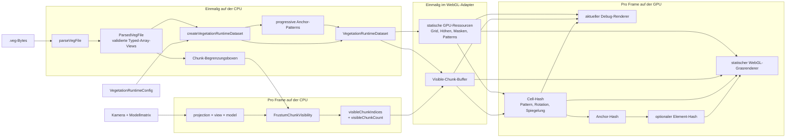

# Runtime-Pipeline

Die Runtime-Pipeline lädt ein VEGFILE, verbindet es mit der Runtime-Config,
bestimmt sichtbare Chunks und stellt die benötigten Daten einem austauschbaren
GPU-Backend bereit. Parser, Dataset, IDs und Chunk-Culling bleiben
rendererunabhängig.

## Datenfluss

Durchgezogene Kanten zeigen den aktuellen Datenweg. Gestrichelte Kanten markieren
die noch zu implementierende produktive Renderstrecke.



## Initialisierung

### 1. Laden und Parsen

Das Laden einer URL bleibt Aufgabe der Anwendung. `parseVegFile` erhält einen
`ArrayBuffer` oder ein `Uint8Array`, validiert VEGFILE v1 vollständig und gibt
ein `ParsedVegFile` zurück. Masken und Heightmaps bleiben gepackt beziehungsweise
quantisiert. Bei geeigneter Ausrichtung zeigen die Typed Arrays direkt auf die
ursprünglichen Dateibytes.

### 2. Runtime-Dataset

`createVegetationRuntimeDataset` verbindet Parserdaten und Runtime-Config über
stabile Layer-IDs. Dabei werden:

- Configwerte einmalig validiert;
- fehlende oder doppelte Layerzuordnungen abgelehnt;
- Cell-Größen in Modell- und Metereinheiten berechnet;
- progressive Anchor-Patterns aus VEGFILE-Seed und Layerconfig erzeugt;
- aktivierte Layer als eigene Ansicht bereitgestellt.

Das Dataset kopiert die großen VEGFILE-Datenbereiche nicht.

### 3. Chunk-Begrenzungsboxen

`createChunkBoundingBoxes` erzeugt für jeden gespeicherten Chunk sechs Werte:

```text
minimumX, minimumY, minimumZ, maximumX, maximumY, maximumZ
```

Diese Boxen liegen im lokalen Modellkoordinatensystem und werden nur einmal
berechnet. Sie sind Zahlendaten und keine unsichtbaren Three.js-Meshes.

### 4. Statische WebGL-Ressourcen

`WebGLStaticVegetationResources` lädt einmalig:

- Gridkoordinaten pro gespeichertem Chunk;
- minimale und maximale Chunkhöhe;
- quantisierte Heightmaps;
- bitgepackte Layer-Masken;
- normalisierte Pattern-Anker.

`WebGLVisibleChunkBuffer` reserviert zusätzlich einmalig Platz für maximal alle
gespeicherten Chunkindizes.

## Verarbeitung pro Frame

### 1. Frustum-Culling

Die Anwendung liefert `projection × view × model` und den Clip-Space-Tiefenraum.
`FrustumChunkVisibility` prüft jede Chunk-Box gegen die sechs Frustumebenen und
überschreibt nur den verwendeten Präfix seines bestehenden Ergebnisarrays:

```text
visibleChunkIndices[0 .. visibleChunkCount)
```

Distanzgrenze, LOD und Verdeckung sind absichtlich nicht Teil dieses Moduls.

### 2. Upload der sichtbaren Chunks

`WebGLVegetationAdapter.updateVisibleChunks` kopiert den gültigen Präfix in den
bereits reservierten Visible-Chunk-Buffer. Es wird kein neues Array pro Frame
angelegt. Der Renderer zeichnet anschließend ausschließlich Einträge dieses
Buffers.

### 3. Aktuelle Debugdarstellung

`WebGLDebugChunkView` zeichnet momentan eine Heightmap-Fläche pro sichtbarem
Chunk. Der Fragment-Shader zeigt aktive Cells und ihre Pattern-Anker. Das ist ein
Pipeline-Test, noch kein produktiver Vegetationsrenderer.

### 4. Statischer WebGL-Grasrenderer

`WebGLGrassView` erzeugt für jedes aktive Render-Tile ein distanzabhängiges,
deterministisches Cell-Präfix und daraus Kandidaten für Anchor und Halm. Der
Vertex-Shader verwirft inaktive Maskenbits, rekonstruiert Pattern und
Hashhierarchie, liest die Heightmap und positioniert je nach LOD ein
Vier- oder Sechs-Vertex-Mesh. Halmform, Versatz und Farben werden vollständig
aus Config und stabilen Hashwerten abgeleitet.

## Koordinaten und Indizes

| Wert | Bedeutung | Speicherung |
| --- | --- | --- |
| `storedChunkIndex` | Adresse eines belegten Chunks in gepackten Arrays und Texturen | VEGFILE und Visible-Chunk-Buffer |
| `chunkGridX/Y` | Stabile Position des Chunks im logischen Grid | Einmal pro gespeichertem Chunk auf der GPU |
| `localCellX/Y` | Cell innerhalb eines Chunks, beispielsweise 0 bis 127 | Aus Maskenindex oder Shaderarbeit abgeleitet |
| `globalCellX/Y` | Cell im gesamten Layergrid | Nicht gespeichert; aus Grid- und lokalen Koordinaten berechnet |
| Modellkoordinaten | Tatsächliche Position relativ zur Modellwurzel | Aus Gridursprung, Chunkgröße, Cellposition und Heightmap rekonstruiert |

Die globale Cell-Koordinate entsteht nur für die stabile Identität:

```text
globalCellX = chunkGridX * maskResolution + localCellX
globalCellY = chunkGridY * maskResolution + localCellY
```

Der `storedChunkIndex` darf nicht Teil einer Vegetations-ID sein, weil er von den
tatsächlich gespeicherten Chunks und ihrer Speicherreihenfolge abhängt.

## Deterministische Hierarchie

```text
VEGFILE-Seed + Layer-ID + globale Cell
                    ↓
                 Cell-Hash
        Pattern, Rotation, Spiegelung
                    ↓ + anchorIndex
                Anchor-Hash
                    ↓ + optionaler elementIndex
                Element-Hash
```

Ein Baum oder Busch kann vollständig aus dem Anchor-Hash randomisiert werden.
Mehrere Elemente pro Anchor sind nur für Vegetationstypen erforderlich, die
mehrere unabhängig variierte Unterobjekte besitzen.

Die CPU- und GLSL-Funktionen verwenden dieselben Salts und Bitlayouts. Details
stehen in `identity/identity.md`.

## Weiterführende Renderstrecke

Der produktive Renderer muss den aktuellen Datenweg fortsetzen:

```text
sichtbare Chunks
→ aktive Cells
→ Pattern-Anker
→ Heightmap-Position
→ Gras-Elemente
→ automatisches LOD
→ Occlusion-Ergebnis
→ Wind, Schatten und weitere Renderprofile
```

Die Reihenfolge und Abnahmekriterien sind in der
[`IMPLEMENTATION_ROADMAP.md`](../../IMPLEMENTATION_ROADMAP.md) festgelegt.
